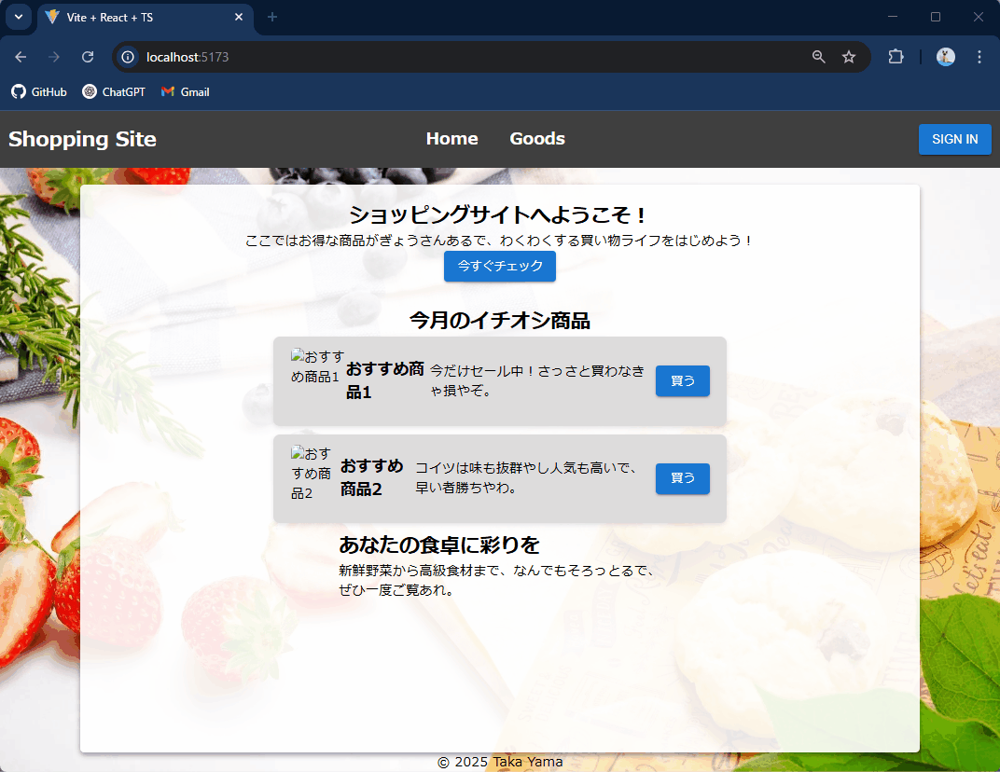

# フロントエンド学習　 React & Firebase でアプリ構築

フロントエンドの勉強の応用として、React と Firebase を用いてサーバーレスのアプリ構築しました。  
成果物は、簡単なショッピングサイトです。  
商品の数量を増やすことでカート数及び、金額を増減させることが出来ます。  
SIGN IN ボタンがありますが、ログインしても特に何もなりません。

## 完成系のイメージ

## 主な機能

- ユーザー認証: Google 認証（Firebase Authentication）
- 商品管理: Firestore よりデータを取得し出力
- カート管理: Redux でカートの中身を管理（商品、商品数、合計数量、合計金額）

## 開発環境

- フレームワーク: React + TypeScript
- パッケージマネージャー: npm
- 環境構築: Vite, Docker（DevContainer）

## 技術スタック

- ライブラリ: React, Vite, TypeScript, React-Redux
- 状態管理: redux Toolkit
- スタイリング:Material UI, SCSS

## バックエンド

- プラットフォーム: Firebase
- 認証: Firebase Authentication
- データベース: Firestore
